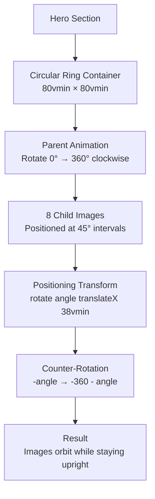

# Hero Component - Circular Ring (Ferris Wheel) Animation Plan

## Overview
Replace the current floating images in [`Hero.tsx`](frontend/components/Hero.tsx:1) with a circular rotating ring of 8 images that orbit around the central text "Marketing that converts". The images will rotate around the center while maintaining their upright orientation.

## Current Implementation Analysis
**Current Behavior:**
- 4 floating images positioned at fixed coordinates
- Images float up/down with subtle rotation
- Text cycles through 3 phrases
- No circular arrangement

**Target Behavior:**
- 8 images arranged in a perfect circle
- Entire ring rotates clockwise (360°)
- Each image rotates counter-clockwise (-360°) to stay upright
- Slow, elegant rotation (40s duration)
- Responsive sizing using vmin units

## Mathematical Foundation: The Ferris Wheel Principle

### Core Concept
To achieve the effect where images orbit a center point but remain vertical (like seats on a Ferris Wheel), we rely on relative motion cancellation.

### Variables
- **T**: Duration of one full rotation = 40 seconds
- **N**: Number of items = 8
- **θ_step**: Angle between items = 360° / 8 = 45°
- **R**: Radius of the ring = 38vmin (responsive)

### The Counter-Rotation Math

**Problem:** If the parent container rotates to angle α, the child item is physically rotated by α. Without counter-action, the image would appear rotated relative to the screen.

**Solution:** Apply a local rotation of -α to cancel the parent's rotation.

**Formula:**
```
Net Rotation = Parent Rotation (α) + Child Rotation (-α) = 0
```

This keeps the image locked to the world's horizon.

### Animation State Table

| Object | Start Rotation | End Rotation (after 1 loop) | Visual Result |
|--------|---------------|----------------------------|---------------|
| Ring (Parent) | 0° | 360° | Spins Clockwise |
| Image (Child) | -angle_initial | -angle_initial - 360° | Spins Counter-Clockwise |

**Why -angle - 360?**
1. The image starts rotated by `-angle` to cancel its placement rotation
2. During the loop, it must rotate an additional `-360°` to counteract the parent's `+360°` movement
3. This ensures images never flip upside down or jitter when the loop resets

## Technical Implementation Plan

### 1. Image Array Setup

Create an array of 8 placeholder images:

```typescript
const ringImages = [
  { src: "https://images.unsplash.com/photo-1542291026-7eec264c27ff?w=500&q=80", alt: "Product 1" },
  { src: "https://images.unsplash.com/photo-1523275335684-37898b6baf30?w=500&q=80", alt: "Product 2" },
  { src: "https://images.unsplash.com/photo-1505740420928-5e560c06d30e?w=500&q=80", alt: "Product 3" },
  { src: "https://images.unsplash.com/photo-1504198458649-3128b932f49e?w=1600&q=80", alt: "Product 4" },
  { src: "https://images.unsplash.com/photo-1572635196237-14b3f281503f?w=500&q=80", alt: "Product 5" },
  { src: "https://images.unsplash.com/photo-1560343090-f0409e92791a?w=500&q=80", alt: "Product 6" },
  { src: "https://images.unsplash.com/photo-1585386959984-a4155224a1ad?w=500&q=80", alt: "Product 7" },
  { src: "https://images.unsplash.com/photo-1596462502278-27bfdc403348?w=500&q=80", alt: "Product 8" },
];
```

### 2. Container Structure

**Parent Container (The Ring):**
```typescript
<motion.div
  className="absolute inset-0 flex items-center justify-center"
  animate={{ rotate: 360 }}
  transition={{
    duration: 40,
    ease: "linear",
    repeat: Infinity
  }}
>
  {/* Child images go here */}
</motion.div>
```

**Key Properties:**
- `absolute inset-0`: Centers the ring in the hero section
- `flex items-center justify-center`: Centers content within the ring
- `animate={{ rotate: 360 }}`: Rotates clockwise 360°
- `duration: 40`: Slow, elegant rotation
- `ease: "linear"`: Constant speed (no acceleration/deceleration)
- `repeat: Infinity`: Loops forever

### 3. Child Image Positioning

**CSS Transform Order (Critical):**
```typescript
transform: rotate(angle) translateX(radius)
```

**Why This Order Matters:**
1. `rotate(angle)`: Rotates the local coordinate system to point toward the "seat" position
2. `translateX(radius)`: Pushes the item out along that rotated angle

**Example for Image at Index 0 (0°):**
```typescript
transform: rotate(0deg) translateX(38vmin)
```
- Starts at 12 o'clock position (top)
- Pushes out 38vmin from center

**Example for Image at Index 2 (90°):**
```typescript
transform: rotate(90deg) translateX(38vmin)
```
- Starts at 3 o'clock position (right)
- Pushes out 38vmin from center

### 4. Child Image Counter-Rotation

**Initial State (Cancel Placement Rotation):**
```typescript
initial={{ rotate: -angle }}
```

**Animation (Counter-Rotate During Loop):**
```typescript
animate={{ rotate: -360 - angle }}
```

**Complete Example for Image at Index 0:**
```typescript
<motion.div
  initial={{ rotate: 0 }}  // -0 = 0 (starts upright)
  animate={{ rotate: -360 }}  // Rotates -360° to counteract parent's +360°
  transition={{
    duration: 40,
    ease: "linear",
    repeat: Infinity
  }}
>
  
</motion.div>
```

**Complete Example for Image at Index 2:**
```typescript
<motion.div
  initial={{ rotate: -90 }}  // Starts at -90° to cancel 90° placement
  animate={{ rotate: -450 }}  // Rotates to -450° (-90 - 360)
  transition={{
    duration: 40,
    ease: "linear",
    repeat: Infinity
  }}
>
  
</motion.div>
```

### 5. Responsive Sizing with vmin

**Why vmin?**
- `vmin` = viewport minimum (smaller of width or height)
- Ensures the circle fits on both mobile (width-constrained) and desktop (height-constrained)
- Maintains perfect circle aspect ratio

**Container Size:**
```typescript
className="w-[80vmin] h-[80vmin]"
```

**Radius Calculation:**
```typescript
const radius = 38; // vmin units
// 38vmin from center = 76vmin diameter
// Fits within 80vmin container with 2vmin padding on each side
```

### 6. Visual Polish

**Image Styling:**
```typescript
className="absolute w-24 h-24 md:w-32 md:h-32 rounded-xl overflow-hidden shadow-2xl border-4 border-white bg-white"
```

**Breakdown:**
- `absolute`: Positioned relative to parent container
- `w-24 h-24`: Mobile size (96px × 96px)
- `md:w-32 md:h-32`: Desktop size (128px × 128px)
- `rounded-xl`: Rounded corners (12px)
- `overflow-hidden`: Clips image to rounded corners
- `shadow-2xl`: Large shadow for depth
- `border-4 border-white`: White border for "sticker" effect
- `bg-white`: White background (fallback)

**Positioning Wrapper:**
```typescript
<div
  style={{
    position: 'absolute',
    left: '50%',
    top: '50%',
    transform: `rotate(${angle}deg) translateX(${radius}vmin)`
  }}
>
  {/* Counter-rotating image */}
</div>
```

### 7. Complete Component Structure

```typescript
<section className="relative h-screen flex flex-col items-center justify-center overflow-hidden">
  {/* Circular Ring Container */}
  <motion.div
    className="absolute w-[80vmin] h-[80vmin]"
    animate={{ rotate: 360 }}
    transition={{
      duration: 40,
      ease: "linear",
      repeat: Infinity
    }}
  >
    {ringImages.map((img, index) => {
      const angle = index * 45; // 0, 45, 90, 135, 180, 225, 270, 315
      return (
        <div
          key={index}
          style={{
            position: 'absolute',
            left: '50%',
            top: '50%',
            transform: `rotate(${angle}deg) translateX(38vmin)`
          }}
        >
          <motion.div
            initial={{ rotate: -angle }}
            animate={{ rotate: -360 - angle }}
            transition={{
              duration: 40,
              ease: "linear",
              repeat: Infinity
            }}
            className="w-24 h-24 md:w-32 md:h-32 rounded-xl overflow-hidden shadow-2xl border-4 border-white bg-white"
          >
            
          </motion.div>
        </div>
      );
    })}
  </motion.div>

  {/* Central Text */}
  <div className="z-10 text-center relative">
    <p className="text-gray-500 text-lg md:text-xl font-medium mb-4 uppercase tracking-widest">We create</p>
    {/* Text animation */}
  </div>
</section>
```

## Animation Timeline

```mermaid
gantt
    title Ferris Wheel Animation Timeline
    dateFormat X
    axisFormat %L

    section Parent Ring
    Rotate 0° → 360° :0, 40

    section Child Images
    Image 0: 0° → -360° :0, 40
    Image 1: -45° → -405° :0, 40
    Image 2: -90° → -450° :0, 40
    Image 3: -135° → -495° :0, 40
    Image 4: -180° → -540° :0, 40
    Image 5: -225° → -585° :0, 40
    Image 6: -270° → -630° :0, 40
    Image 7: -315° → -675° :0, 40
```

## Visual Flow Diagram



## Positioning Visualization

```
         Image 0 (0°)
            ↑
            |
Image 7 (315°) ←   → Image 1 (45°)
            |
            |
Image 6 (270°) ←   → Image 2 (90°)
            |
            |
Image 5 (225°) ←   → Image 3 (135°)
            |
            ↓
         Image 4 (180°)
```

## Key Technical Considerations

### Performance
- Use `transform` and `opacity` for GPU-accelerated animations
- Avoid animating `top`, `left`, `width`, `height` (causes layout thrashing)
- Linear easing is most performant for continuous rotation
- Test on mobile devices for smooth 60fps

### Browser Compatibility
- Framer Motion supports modern browsers
- CSS transforms are widely supported
- vmin units work in all modern browsers
- Test in Chrome, Firefox, Safari, Edge

### Accessibility
- Ensure images have meaningful `alt` text
- Consider `prefers-reduced-motion` media query
- Provide fallback for users who disable animations
- Maintain sufficient contrast for central text

### Responsive Design
- **Mobile (< 768px)**: 96px × 96px images (w-24 h-24)
- **Desktop (≥ 768px)**: 128px × 128px images (w-32 h-32)
- **Container**: 80vmin × 80vmin (scales with viewport)
- **Radius**: 38vmin (fits within container with padding)

### Visual Hierarchy
- Central text remains at z-index 10 (above ring)
- Ring images at z-index 1 (below text but visible)
- Shadows and borders create depth
- White borders separate images from background

## Implementation Steps

1. **Create image array**: Define 8 placeholder images with alt text
2. **Set up parent container**: Create 80vmin × 80vmin container with rotation animation
3. **Position child images**: Map through array, calculate angles, apply transforms
4. **Implement counter-rotation**: Add child animations with -360 - angle rotation
5. **Style images**: Add borders, shadows, rounded corners, responsive sizes
6. **Configure timing**: Set 40s duration, linear easing, infinite repeat
7. **Test responsiveness**: Verify on mobile, tablet, desktop
8. **Refine visual polish**: Adjust shadows, borders, spacing as needed

## Success Criteria

- ✅ 8 images arranged in perfect circle
- ✅ Ring rotates clockwise (360°) over 40 seconds
- ✅ Each image rotates counter-clockwise (-360°) to stay upright
- ✅ Images never flip upside down or jitter
- ✅ Smooth, continuous animation (60fps)
- ✅ Responsive sizing using vmin units
- ✅ Works on mobile, tablet, and desktop
- ✅ Visual polish (borders, shadows, rounded corners)
- ✅ Central text remains readable and accessible
- ✅ Performance remains smooth

## Next Steps

Once this plan is approved, switch to Code mode to implement the changes in `frontend/components/Hero.tsx`.
