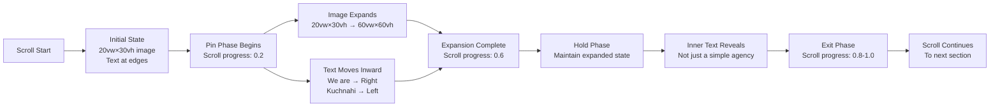

# WeAre Component Scroll-Pinning Effect Plan

## Overview
Update the `WeAre.tsx` component to implement a scroll-pinning effect where the section stops scrolling for 2-3 screen heights, allowing users to focus on the "We Are [Image] Kuchnahi" connection before continuing to scroll.

## Current Behavior Analysis
- **Container Height**: 300vh (3 screen heights)
- **Scroll Range**: 0 to 1 (full scroll progress)
- **Image Expansion**: Expands from 20vw×30vh to 100vw×100vh (full screen)
- **Text Animation**: "We are" and "Kuchnahi" split apart horizontally
- **Pin Duration**: Implicit, not explicitly configured

## Target Behavior
- **Pin Duration**: 2-3 screen heights of scroll-stopping effect
- **Image Expansion**: Expands from 20vw×30vh to 50-70vw×50-70vh (moderate, not full screen)
- **Text Animation**: "We are" and "Kuchnahi" move toward center around the image
- **Scroll Continuation**: Smooth transition after pin ends

## Technical Implementation Plan

### 1. Container Height Adjustment
**Current**: `h-[300vh]`
**Target**: Keep at `h-[400vh]` or `h-[500vh]` to accommodate longer pin duration

**Rationale**: More height allows for extended pin phase while maintaining smooth scroll progression.

### 2. Scroll Offset Configuration
**Current**:
```typescript
offset: ["start start", "end end"]
```

**Target**:
```typescript
offset: ["start start", "end end"]
```
Keep same offsets but adjust animation ranges to create pin effect.

**Key Change**: Modify scroll progress ranges to create distinct phases:
- **Phase 1 (0-0.2)**: Initial state, no expansion
- **Phase 2 (0.2-0.6)**: Pin phase - image expands moderately, text moves toward center
- **Phase 3 (0.6-0.8)**: Hold phase - maintain expanded state
- **Phase 4 (0.8-1.0)**: Exit phase - fade out or scroll away

### 3. Image Expansion Animation
**Current**:
```typescript
const width = useTransform(scrollYProgress, [0, 0.3], ["20vw", "100vw"]);
const height = useTransform(scrollYProgress, [0, 0.3], ["30vh", "100vh"]);
```

**Target**:
```typescript
const width = useTransform(scrollYProgress, [0.2, 0.6], ["20vw", "60vw"]);
const height = useTransform(scrollYProgress, [0.2, 0.6], ["30vh", "60vh"]);
```

**Rationale**: 
- Start expansion at scroll progress 0.2 (after initial scroll)
- End expansion at scroll progress 0.6 (creating 0.4 scroll range = 2 screen heights)
- Target size: 60vw×60vh (moderate, not full screen)

### 4. Text Connection Animation
**Current**: Text splits apart horizontally
```typescript
const splitX = useTransform(scrollYProgress, [0, 0.3], ["0%", "100%"]);
```

**Target**: Text moves toward center around image
```typescript
// "We are" moves right toward image
const weAreX = useTransform(scrollYProgress, [0.2, 0.5], ["0%", "15%"]);
const weAreOpacity = useTransform(scrollYProgress, [0.2, 0.5], [1, 0.8]);

// "Kuchnahi" moves left toward image
const kuchnahiX = useTransform(scrollYProgress, [0.2, 0.5], ["0%", "-15%"]);
const kuchnahiOpacity = useTransform(scrollYProgress, [0.2, 0.5], [1, 0.8]);
```

**Rationale**:
- Both text elements move inward toward the image
- Creates a "connection" effect where text embraces the image
- Subtle opacity change adds depth
- Movement range (±15%) creates visible but not overwhelming motion

### 5. Border Radius Animation
**Current**:
```typescript
const radius = useTransform(scrollYProgress, [0, 0.3], ["100px", "0px"]);
```

**Target**:
```typescript
const radius = useTransform(scrollYProgress, [0.2, 0.6], ["100px", "20px"]);
```

**Rationale**: 
- Maintain some rounded corners (20px) instead of fully square (0px)
- Keeps the image feeling contained and organic
- Aligns with moderate expansion (not full screen)

### 6. Image Scale Animation
**Current**:
```typescript
style={{ scale: useTransform(scrollYProgress, [0, 0.4], [1.2, 1]) }}
```

**Target**:
```typescript
style={{ scale: useTransform(scrollYProgress, [0.2, 0.6], [1.2, 1]) }}
```

**Rationale**: 
- Gentle zoom-in effect during expansion
- Aligns timing with width/height expansion

### 7. Inner Text Reveal Animation
**Current**:
```typescript
const textRevealOpacity = useTransform(scrollYProgress, [0.35, 0.5], [0, 1]);
const textRevealY = useTransform(scrollYProgress, [0.35, 0.5], [50, 0]);
```

**Target**:
```typescript
const textRevealOpacity = useTransform(scrollYProgress, [0.5, 0.7], [0, 1]);
const textRevealY = useTransform(scrollYProgress, [0.5, 0.7], [30, 0]);
```

**Rationale**:
- Reveal after image expansion is mostly complete
- Shorter vertical movement (30px) for subtler effect
- Creates layered animation sequence

### 8. Exit Animation (Optional)
Add fade-out effect after pin ends:
```typescript
const exitOpacity = useTransform(scrollYProgress, [0.8, 1.0], [1, 0]);
```

Apply to container or main wrapper for smooth exit.

## Animation Timeline

```mermaid
gantt
    title WeAre Component Scroll Animation Timeline
    dateFormat X
    axisFormat %L
    
    section Scroll Progress
    Initial State       :0, 0.2
    Image Expansion     :0.2, 0.6
    Text Connection     :0.2, 0.5
    Hold Expanded State :0.6, 0.8
    Inner Text Reveal   :0.5, 0.7
    Exit Phase          :0.8, 1.0
```



## Visual Flow Diagram



## Key Technical Considerations

### Performance
- Use `useTransform` for smooth, GPU-accelerated animations
- Avoid layout thrashing by animating transform/opacity properties
- Test on mobile devices for performance

### Accessibility
- Ensure animations respect `prefers-reduced-motion` media query
- Maintain readable text contrast throughout animation
- Consider adding animation controls (pause/play)

### Responsive Design
- Adjust vw/vh values for different screen sizes
- Test on mobile, tablet, and desktop breakpoints
- Consider using Tailwind's responsive classes (md:, lg:)

### Browser Compatibility
- Framer Motion supports modern browsers
- Test in Chrome, Firefox, Safari, and Edge
- Consider fallback for older browsers if needed

## Implementation Steps

1. Update container height to `h-[400vh]` or `h-[500vh]`
2. Modify scroll progress ranges for all animations
3. Update image expansion (width/height) to 60vw×60vh
4. Redesign text animation to move inward toward center
5. Adjust border radius to maintain 20px rounded corners
6. Update inner text reveal timing
7. Add optional exit animation
8. Test and refine easing functions for smooth transitions

## Success Criteria

- ✅ Section pins for 2-3 screen heights
- ✅ Image expands to moderate size (50-70vw×50-70vh), not full screen
- ✅ "We are" and "Kuchnahi" text moves toward center around image
- ✅ Smooth scroll continuation after pin ends
- ✅ Animations feel natural and not jarring
- ✅ Performance remains smooth (60fps)
- ✅ Works across different screen sizes

## Next Steps

Once this plan is approved, switch to Code mode to implement the changes in `frontend/components/WeAre.tsx`.
